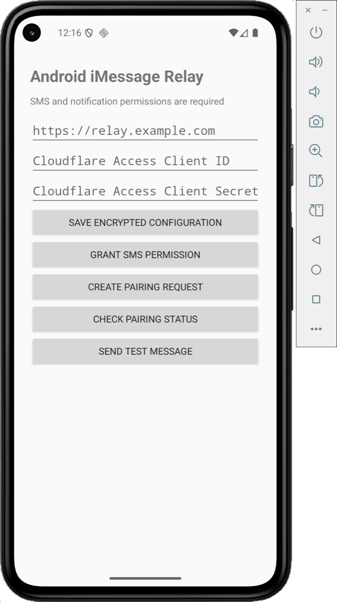
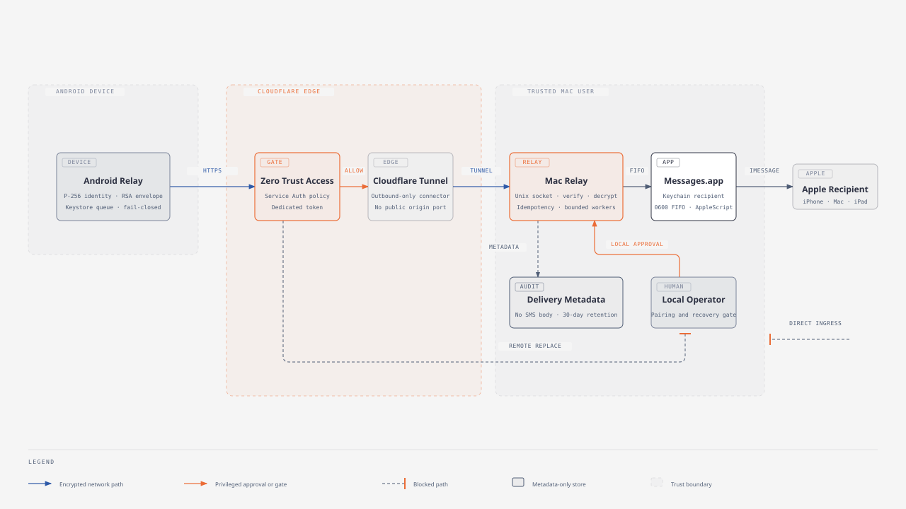

# Android iMessage Relay

[](https://github.com/ParryQiu/android-imessage-relay/actions/workflows/ci.yml)
[](https://github.com/ParryQiu/android-imessage-relay/actions/workflows/codeql.yml)
[](https://github.com/ParryQiu/android-imessage-relay/releases)
[](LICENSE)
[](android/)
[](mac/)
[](infra/cloudflare/)

Android iMessage Relay privately forwards SMS messages received by an Android phone to a recipient in Apple Messages. The phone may leave the home network. A Cloudflare Tunnel carries outbound-only traffic to a Mac that remains behind its router, so no public IP address or port forwarding is required.

The project does not use Bark, IFTTT, Workers, D1, KV, R2, or a project-operated cloud service. The only cloud infrastructure managed by an operator is Cloudflare Tunnel and Cloudflare Zero Trust Access. A signed-in, awake Mac and Apple's Messages, iMessage, and APNs services are runtime dependencies, but they are not self-hosted cloud infrastructure.

This project is not affiliated with or endorsed by Apple Inc. or Cloudflare, Inc.

## Android app

<p align="center">
  
</p>

The setup screen shown above is an unconfigured Android Emulator instance. It contains no production endpoint, Cloudflare Access credentials, pairing data, or SMS content.

## Documentation

| Guide | Scope |
| --- | --- |
| [Architecture](docs/architecture.md) | Components, trust boundaries, pairing, permitted and blocked paths, data handling, and failure behavior |
| [Cloudflare deployment](infra/cloudflare/README.md) | Terraform inputs, Access policy, Tunnel ingress, validation, and sensitive-state handling |
| [Migration and rollback](docs/migration.md) | Side-by-side migration, acceptance gates, rollback, and legacy cleanup |
| [Security audit](docs/security-audit.md) | Initial public-release findings, remediation, and residual operational gates |
| [Security policy](SECURITY.md) | Supported versions, private reporting, response expectations, and operator guidance |
| [Release process](RELEASING.md) | Local signing, checksums, SBOM generation, tag controls, and release verification |
| [Support](SUPPORT.md) | Safe support channels and required sanitization |

## Architecture



The Android device signs every request with a non-exportable P-256 key and encrypts every SMS with a fresh AES-256-GCM key. The message key is wrapped with the paired Mac's RSA-3072 public key. The Mac verifies and decrypts the envelope in process, records only delivery metadata, and passes the recipient and message body to AppleScript through a short-lived FIFO.

See the [complete architecture guide](docs/architecture.md) for trust boundaries, pairing, blocked paths, component responsibilities, data retention, failure behavior, and Cloudflare metadata visibility. The diagram is also available as a [standalone HTML document](docs/assets/architecture.html).

## Security model

- A generic APK contains no endpoint, credentials, tunnel data, deployment public key, phone number, hostname, or local path.
- The SMS receiver and all network operations remain disabled until local pairing is approved on the Mac.
- Pairing verifies possession of the Android device key. Both devices show the same short verification code, and the request expires after five minutes.
- Replacing a paired device requires the local `--replace` recovery option on the Mac.
- The relay endpoint, Cloudflare Access credentials, pairing state, and retry queue are encrypted with Android Keystore keys.
- Message IDs are independent 256-bit random values and reveal nothing about the SMS body.
- The Android queue is limited to 1,000 records, 16 MiB, and seven days. The oldest records are discarded at the limit, and only a body-free discard count is retained.
- The Mac retains delivery metadata for 30 days, limits the delivery table to 10,000 rows, and recovers abandoned work with expiring leases.
- The HTTP server uses a fixed thread pool, request/header limits, timeouts, a small backlog, and overload responses.
- The default origin is a mode `0600` Unix socket. Optional TCP origin mode requires TLS certificates.
- The Apple Messages recipient is stored in macOS Keychain. SMS content is never written to a regular temporary file.
- Public errors follow the `google.rpc.Status` shape and never include exception stacks, local paths, keys, credentials, or SMS content.

Cloudflare can observe the relay hostname, request timing, source network address, approximate encrypted payload size, Access identity metadata, HTTP method/path, and transport status. Cloudflare and APNs cannot decrypt the SMS envelope. Apple Messages necessarily receives the final plaintext message and recipient.

See [SECURITY.md](SECURITY.md) for reporting and operational guidance.
The initial public-release audit and remediation summary is available in [docs/security-audit.md](docs/security-audit.md).

## Requirements

### Android

- Android 8.0 (API 26) or newer
- A device capable of receiving SMS broadcasts
- Permission to receive SMS, start after boot, run a foreground data-sync service, use the network, and show notifications
- ROM-specific autostart and battery-optimization exemptions when required

The app does not request contacts, call log, phone, location, camera, storage, or notification-listener permissions.

### Mac

- A Mac that remains signed in to the intended Apple account
- Messages configured and able to send an iMessage to the recipient
- Python 3.10 or newer; Python 3.12 is recommended
- Xcode Command Line Tools for the Keychain helper
- `cloudflared` running as the same trusted local user or otherwise permitted to access the Unix socket

### Cloudflare

- A Cloudflare-managed DNS zone
- An existing Cloudflare Tunnel
- Zero Trust Access with permission to create a self-hosted application, Service Auth policy, and service token
- A narrowly scoped Cloudflare API token if using the Terraform template

## Install the Mac relay

Clone the repository on the Mac and run the installer in dry-run mode first:

```shell
cd mac
PYTHON_BIN=/opt/homebrew/bin/python3.12 ./install.sh dry-run
```

The installer creates a project virtual environment, verifies hashed dependencies, compiles the Keychain helper, and installs a neutral LaunchAgent. Dry-run mode processes valid envelopes without sending them through Messages.

Store the destination address through standard input so it is not placed in shell history:

```shell
read -rs "REPLY?Apple Messages recipient: " RECIPIENT_VALUE
printf '%s' "$RECIPIENT_VALUE" | \
  "$HOME/Library/Application Support/AndroidIMessageRelay/venv/bin/android-imessage-relay" \
  set-recipient \
  --recipient-helper "$HOME/Library/Application Support/AndroidIMessageRelay/bin/recipient-keychain"
unset RECIPIENT_VALUE
```

After dry-run testing, reinstall in live mode:

```shell
PYTHON_BIN=/opt/homebrew/bin/python3.12 ./install.sh live
```

macOS will request permission for the relay to automate Messages the first time a live message is sent.

## Configure Cloudflare

The reusable Terraform template is in [`infra/cloudflare`](infra/cloudflare/). It creates a proxied CNAME, self-hosted Access application, dedicated service token, and Service Auth policy. It targets an existing Tunnel and does not create, read, import, output, or rotate the Tunnel token.

Terraform state contains the Access Client Secret and is sensitive. Use a protected state backend and never commit state or plans.

```shell
cd infra/cloudflare
cp terraform.tfvars.example terraform.tfvars
export CLOUDFLARE_API_TOKEN='set-without-committing-it'
terraform init
terraform fmt -check
terraform validate
terraform plan -out relay.tfplan
terraform apply relay.tfplan
```

Copy `cloudflared-config.yml.example` outside this repository. Replace the placeholders and point the hostname at the installed relay socket. Validate before restarting:

```shell
cloudflared tunnel ingress validate
cloudflared tunnel ingress rule https://relay.example.com/v1/health
```

Do not expose the Unix socket through a public listener. If migration requires a TCP origin, start the relay with `--listen`, `--tls-cert`, and `--tls-key`; TCP binds are restricted to `127.0.0.0/8` or `::1`, and `cloudflared` must verify the certificate. Remove TCP mode after migration.

## Install Android

Download the APK, checksum, and certificate fingerprint from the same GitHub Release. Verify all three before installation:

```shell
shasum -a 256 -c android-imessage-relay-v0.1.0.apk.sha256
apksigner verify --print-certs android-imessage-relay-v0.1.0.apk
adb install android-imessage-relay-v0.1.0.apk
```

The expected package name is `io.github.parryqiu.androidimessagerelay`. Release signing is performed locally; no signing private key is stored in this repository or GitHub Actions.

## Configure and pair

1. Open the Android app. Screenshots are disabled on the setup screen.
2. Enter the bare HTTPS endpoint, dedicated Cloudflare Access Client ID, and Client Secret.
3. Save the encrypted configuration. The secret fields clear immediately.
4. Select **Create pairing request**. Android displays a verification code.
5. On the Mac, list pending requests:

   ```shell
   "$HOME/Library/Application Support/AndroidIMessageRelay/venv/bin/android-imessage-relay" \
     --data-dir "$HOME/Library/Application Support/AndroidIMessageRelay/data" pending
   ```

6. Confirm that the Mac and Android codes match, then approve by code:

   ```shell
   "$HOME/Library/Application Support/AndroidIMessageRelay/venv/bin/android-imessage-relay" \
     --data-dir "$HOME/Library/Application Support/AndroidIMessageRelay/data" \
     approve ABCD-1234
   ```

7. Select **Check pairing status** on Android. Grant SMS permission only after the app reports that pairing is approved.
8. Select **Send test message** and verify the dry-run logs or live Apple Messages delivery.

To reject a request, replace `approve` with `reject`. To replace an already paired device, perform the same local approval with `approve --replace`; this deliberately cannot be done remotely.

## API

The public API uses camelCase JSON and resource-oriented names:

| Method | Resource | Purpose |
| --- | --- | --- |
| `POST` | `/v1/pairingRequests` | Create a short-lived pairing resource after proof-of-possession validation |
| `GET` | `/v1/pairingRequests/{id}` | Read pending, approved, rejected, or expired state |
| `POST` | `/v1/messages` | Create one encrypted, idempotent delivery |
| `GET` | `/v1/health` | Return only a generic serving state |

Errors use this structure:

```json
{
  "error": {
    "code": 16,
    "status": "UNAUTHENTICATED",
    "message": "Authentication is required"
  }
}
```

## Acceptance test

Do not treat a successful build or synthetic request as end-to-end acceptance. Before a release is declared stable, verify:

1. The Android channel test reaches the intended Apple Messages recipient.
2. A real Chinese SMS arrives on Android and appears completely on the Apple recipient within 30 seconds.
3. A real six-digit verification-code SMS is readable and easy to copy.
4. There is no duplicate after retrying the same encrypted message.
5. A temporary network outage recovers without duplicate delivery.
6. Delivery still works after 30 minutes with the Android screen off.
7. Delivery still works after Android and Mac restarts.
8. The process, queue counters, delivery database, and logs remain healthy for 24 hours.

Before the first real SMS, revoke SMS permission from any older relay app to prevent duplicate forwarding.

## Upgrade and rollback

- Back up the Mac data directory, RSA private key, device binding, and delivery database before upgrading.
- Keep the previous APK and LaunchAgent available until the 24-hour acceptance window finishes.
- The new package ID allows side-by-side Android installation, but only one app may hold active SMS forwarding permission.
- If acceptance fails, stop the new LaunchAgent, restore the previous Android SMS permission, and restore the backup.
- Revoke the old Access service token only after the new path is stable.
- Never rotate a Tunnel token merely as part of an application upgrade; determine its shared impact first.

See [RELEASING.md](RELEASING.md) for artifact signing and release checks.
See [docs/migration.md](docs/migration.md) for the complete reversible migration sequence.

## Uninstall

Revoke the Android app's SMS permission, uninstall `io.github.parryqiu.androidimessagerelay`, disable and remove the Mac LaunchAgent, remove the application directory after making any required backup, and delete the dedicated Cloudflare service token and Access application. Removing the relay does not require deleting a shared Tunnel.

## Troubleshooting

- **Android receives SMS but nothing is queued:** confirm pairing, SMS permission, ROM autostart, and battery exemptions. Notification-listener fallback is intentionally not used because it exposes unrelated notifications.
- **Queue grows while the phone is away:** check Internet access, endpoint hostname, Access token status, Tunnel health, and `/v1/health`. Never paste the Client Secret into a command line or support ticket.
- **Cloudflare returns 401 or 403:** ensure Access covers the exact hostname and permits the dedicated service token through Service Auth.
- **Mac returns 401 behind Access:** the relay requires `Cf-Access-Jwt-Assertion` by default. Configure Tunnel Access validation; do not synthesize the header at an Internet-facing proxy.
- **Messages does not send:** keep the Mac logged in and awake, confirm manual sending, inspect Automation permission, and reset the Keychain recipient.
- **Pairing expired:** create a new request. Expired, rejected, and approved requests cannot be replayed.

## Limitations

- SMS text only; MMS images and attachments are not forwarded.
- The app does not monitor WeChat or any other application.
- Android vendor ROMs may delay background work or suppress SMS broadcasts.
- The Mac must remain signed in, awake, online, and able to send through Messages.
- iMessage availability, Apple account state, and APNs behavior are outside this project's control.
- The Cloudflare edge necessarily sees transport metadata even though SMS content is encrypted between Android and Mac.

## Development

Android builds require JDK 17:

```shell
cd android
./gradlew test lint assembleDebug
```

Mac tests use an isolated virtual environment and hash-locked dependencies:

```shell
cd mac
python3.12 -m venv .venv
.venv/bin/pip install --require-hashes -r dev-requirements.lock
.venv/bin/pip install --no-deps -e .
.venv/bin/pytest
```

The test suite includes Java-to-Python encryption and signature interoperability and generates temporary keys at runtime. No test private key is committed.

Contributions are welcome under [CONTRIBUTING.md](CONTRIBUTING.md) and the [Code of Conduct](CODE_OF_CONDUCT.md).

## License

MIT License. See [LICENSE](LICENSE).
